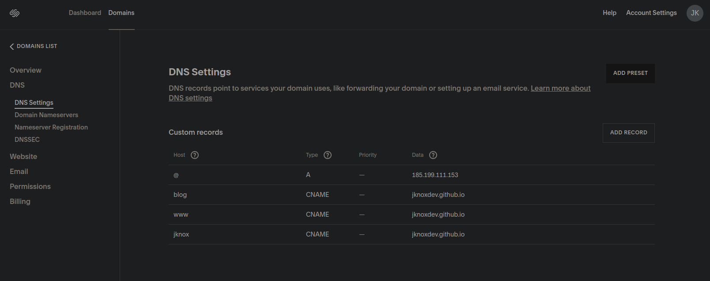
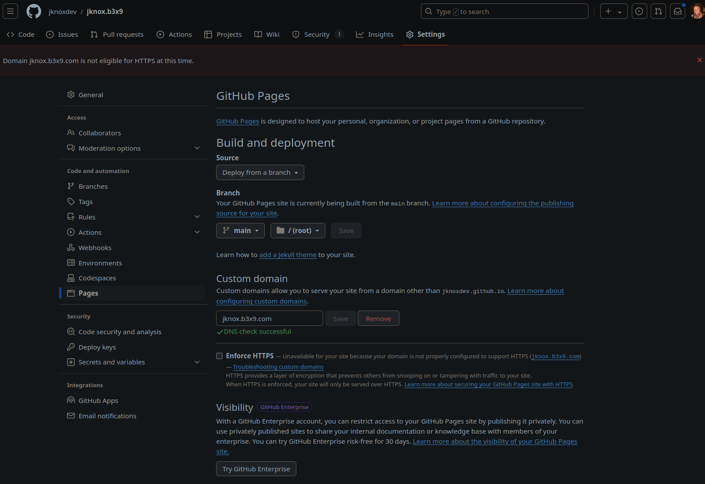

# local notes

- tech used: 

[@11ty/eleventy ](https://www.11ty.dev/)

```bash
cd ~/code/jknoxdev/www.b3x9.github.io
npx @11ty/eleventy --serve
firefox localhost:8080
```

```bash
npm install @11ty/eleventy-plugin-rss
```

# web hosting setup 

- clone the template from the google page, and name the new repo: 

redirected.registeredomain.github.io

where redirected will be the project's new subdomain with the squarespace cname redirector: 


- next in the 'Custom domain' section, we will enter the subdir.tld.com and also switch 'build and deployment' over to deploy from branch. in this case the main branch will work!


clone the repo on your workstation

```bash
git clone subdir.tld.github.io
```

- cd into the directory, and setup npm

```bash
cd subdir.tld.github.io
npm i
```

- if it works, congratsNPM is setup! now lets run the preview and start updating the template! 

```bash
npm run watch
```

- point the browser to: 


[`http://localhost:8080`](http://localhost:8080)

